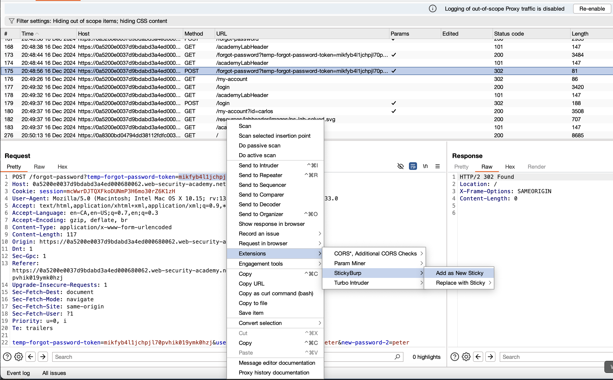
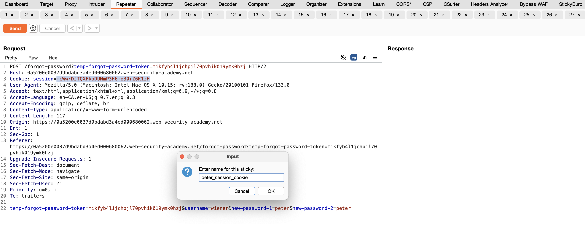
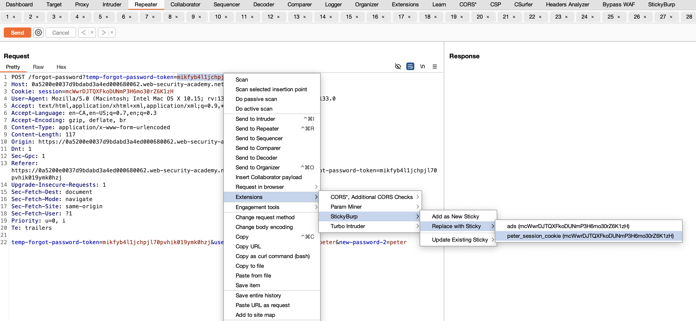

# stickyburp

No more `notes.txt`! 🤙

A Burp Suite extension written in Kotlin that allows you to create and manage "stickies" (aka Environment Variables) from selected text across different Burp Suite panels. Think of this extension as the same functionality you get in an API testing and development tool to store variables with raw values that can be used across different views.

<br clear="left"/>

<div align="center">


<br>
<br>

[](https://github.com/GangGreenTemperTatum/stickyburp/releases)
[](https://github.com/GangGreenTemperTatum/stickyburp/stargazers)
[](https://github.com/GangGreenTemperTatum/stickyburp/blob/main/LICENSE)

[Report Bug](https://github.com/GangGreenTemperTatum/stickyburp/issues) •
[Request Feature](https://github.com/GangGreenTemperTatum/stickyburp/issues)

</div>

- [stickyburp](#stickyburp)
  - [Features](#features)
  - [Demo](#demo)
  - [Screenshots](#screenshots)
    - [Proxy Tab Usage](#proxy-tab-usage)
    - [Repeater Tab Usage](#repeater-tab-usage)
    - [Stickies Tab Colorized Default](#stickies-tab-colorized-default)
    - [Stickies Tab Colorized Custom](#stickies-tab-colorized-custom)
    - [Stickies Tab Sorting Functionality](#stickies-tab-sorting-functionality)
  - [Building](#building)
    - [Prerequisites](#prerequisites)
    - [Build Steps (from source)](#build-steps-from-source)
  - [Installation / Loading the extension](#installation--loading-the-extension)
  - [Usage](#usage)
  - [Contributing and Supporting](#contributing-and-supporting)
    - [Star History](#star-history)
  - [Development](#development)

## Features

- **Sticky Management**
  - Create and store stickies from any selected text in Burp Suite
  - Stickies store name, value, and source information
  - Replace the values in Repeater tab with the raw value of the previously saved sticky
  - Update existing stickies with new values and add your own notes
  - Copy stickies values to clipboard with right-click
  - Stickies can be colored for easier visibility and are by default colored
  - Stickies are persisted across projects even when burp is quit and reopened
  - Sort and order your stickies using the row sorting functionality

- **Context Menu Integration**
  - Right-click selected text to create new stickies
  - Quick access to update existing stickies
  - Source tracking shows which HTTP request the stickies came from
  - Works in Burp tools for both HTTP Requests and Responses (Proxy, Repeater, Target (Site Map) etc.)

- **Dedicated UI Tab**
  - Table view of all stored stickies
  - Shows stickies name, value, and source
  - Manual add/update functionality
  - Right-click menu for copying values
  - Visual feedback for all operations

- **Data Persistence**
  - Stickies maintained throughout Burp Suite session and in project after quitting Burp
  - Easy to update and manage values
  - Protection against duplicate stickies names
  - Validation to prevent empty values

- **Hotkeys/Shortcuts** (**No more clicks!**)
  - Automatically switch to the StickyBurp tab using "`CMD`"("`Control`" for Windows users)+"`Shift`"+"`S`"


*stickyburp hotkeys demo*

## Demo


*stickyburp in action!*

## Screenshots

### Proxy Tab Usage

*Selecting and storing stickies from the Proxy tab*

### Repeater Tab Usage

*Using stored stickies in Repeater requests*


*Quick stickies replacement in action*

### Stickies Tab Colorized Default

*Default Stickies Coloring*

### Stickies Tab Colorized Custom

*Custom Stickies Coloring*

### Stickies Tab Sorting Functionality

*stickyburp tabs sorted*

---

## Building

### Prerequisites

- JDK 21 or lower
- Gradle (included via wrapper)

### Build Steps (from source)

1. Clone the repository:
```bash
git clone https://github.com/yourusername/stickyburp.git
cd stickyburp
```

2. Build the extension:
```bash
./gradlew shadowJar
```

The compiled extension JAR will be available at:
```bash
build/libs/stickyburp-all.jar
```

---

## Installation / Loading the extension

1. Open Burp Suite
2. Go to Extensions tab
3. Click "Add" button
4. Select "Extension type" as Java
5. Click "Select file" and choose `build/libs/stickyburp-all.jar`
6. Click "Next" to load the extension

---

## Usage

1. **Creating Stickies**:
   - Select any text in Burp Suite (Proxy, Repeater, etc.)
   - Right-click and choose "Add to stickyburp"
   - Enter a name for your variable
   - The variable will appear in the stickyburp tab

2. **Using Stickies**:
   - Go to the stickyburp tab to view all stored stickies
   - Click on a variable to copy its value
   - Use copied values in any Burp Suite tool (Repeater, Intruder, etc.)
   - Use quick replace to swap values in requests

3. **Managing Stickies**:
   - View all stickies in the table
   - See the source of each variable
   - Copy values directly from the table
   - Add new stickies manually if needed

---

## Contributing and Supporting
1. Fork the repository
2. Create your feature branch (`git checkout -b feature/amazing-feature`)
3. Commit your changes (`git commit -m 'Add some amazing feature'`)
4. Push to the branch (`git push origin feature/amazing-feature`)
5. Open a Pull Request

<br>

[](https://github.com/GangGreenTemperTatum/stickyburp/stargazers/)

### Star History

[](https://star-history.com/#GangGreenTemperTatum/stickyburp&Date)

---

## Development

Core Functionality:
- `StickyVariable.kt`: Data class representing variables with name, value, and source
- `StickyBurpTab.kt`: Main UI component managing the variable table and operations
- `StickyBurpContextMenu.kt`: Context menu integration for variable operations
- `StickyBurpHttpHandler.kt`: HTTP request/response handler for variable replacement
- `StickyBurpExtension.kt`: Main extension entry point and initialization

Want to contribute? Check out our [feature request template](/.github/ISSUE_TEMPLATE/feature_request.md) for ideas or to propose new functionality!

The project uses Gradle with Kotlin for building and testing.